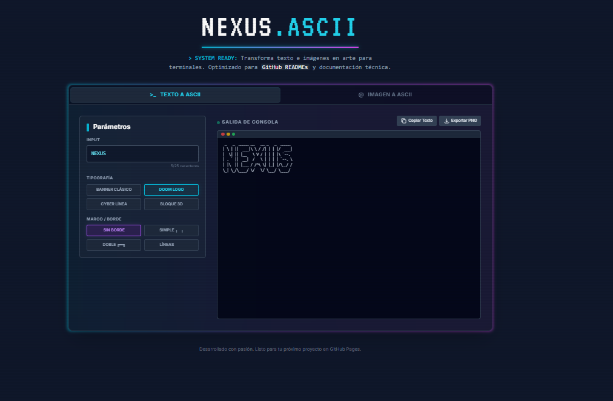

## 🌐 Despliegue

Puedes ver la aplicación en funcionamiento: [Enlace a la App](https://frankusqabant.github.io/NEXUS-ASCII-Generator/)

<div align="center">
  
</div>

# Nexus ASCII Generator

¡Bienvenido a Nexus ASCII Generator! Una aplicación web moderna y rápida para generar arte ASCII, construida con React y Vite.

## 🚀 Introducción

Este proyecto es una herramienta interactiva que permite a los usuarios crear y visualizar arte ASCII. Diseñada para ser intuitiva y eficiente, aprovecha la potencia de las tecnologías web modernas para ofrecer una experiencia fluida.

## ✨ Características

- **Generación Rápida**: Visualización instantánea de arte ASCII.
- **Interfaz Moderna**: Diseño limpio y fácil de usar.
- **Tecnología de Punta**: Construido sobre el ecosistema de React y Vite para un rendimiento óptimo.

## 🛠️ Tecnologías Utilizadas

- **[React](https://reactjs.org/)**: Biblioteca para construir interfaces de usuario.
- **[Vite](https://vitejs.dev/)**: Herramienta de construcción frontend de próxima generación.
- **[TypeScript](https://www.typescriptlang.org/)**: Superset tipado de JavaScript.

## 💻 Instalación y Uso Local

Sigue estos pasos para ejecutar la aplicación en tu máquina local:

**Prerrequisitos:** Asegúrate de tener instalado [Node.js](https://nodejs.org/).

1. **Instalar dependencias:**
   ```bash
   npm install
   ```

2. **Configurar entorno:**
   Configura tu `GEMINI_API_KEY` en el archivo [.env.local](.env.local).

3. **Ejecutar la aplicación:**
   ```bash
   npm run dev
   ```


